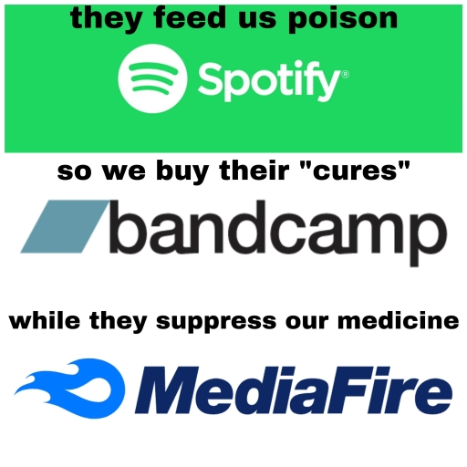

# words on youtube

the choice to stream exclusively on youtube (for now) is not a statement of moral purity. as I write this, it has come out that last night google (likely highly illegally in this layman's opinion) [laid off youtube music workers mid-hearing](https://twitter.com/peepaw_/status/1763376791861735583) at austin city council. every corporation with a chokehold on music distribution participates in anti-labor practices [and often worse](https://inthesetimes.com/article/spotify-military-industrial-complex-daniel-ek-prima-materia-helsing). 

all platforms being fairly equal in that regard, the real purpose is to experiment with different forms of music distribution rather than the current default of paying your $30 to distrokid to indiscriminately upload it to everything, because differences in platforms can feel like they mean nothing when there is no expectation of fair compensation.

youtube is accessible on virtually every device with a screen that connects to the internet. it has a long established histroy of hosting content for free indefinitely. it embeds onto any website without javascript and virtually all web platforms have some kind of integration with it. streaming is the current paradigm, and if music needs to be on streaming in order for it to be accessible, I decided I'd try deliberately choosing what I consider to be the most accessible platform that currently exists. 

the distribution model for freeware.fyi will almost certainly change over time but as it currently stands, since the big music streaming platforms take it for granted that our music will be handed over to them by default for them to profit off of, any tiny effort to subvert that and exercise what little control musicians have is worth trying and seeing what happens I think.

